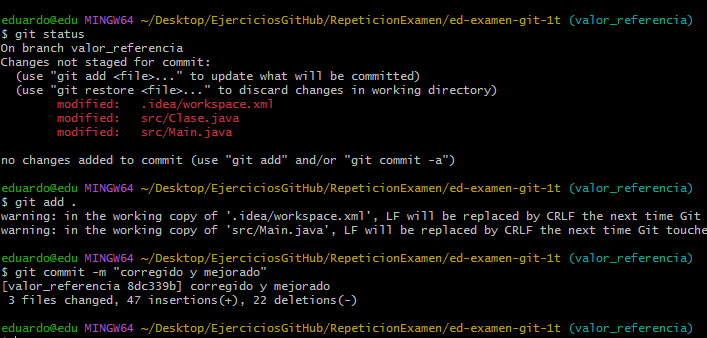

* Eduardo Perez Garcia 
* GRUPO DAM 

1. Creación de un proyecto de IntelliJ con repositorio Git y código de ejemplo.

  

2. Primer commit en master.

- Hacemos el primer commit por defecto **proyecto base**

* git status *
* git add . *
* git commit -m "proyecto base" *

	
3. Creamos y desarrollamos la rama valor_referencia.

- Creamos la rama **valor_referencia**, nos cambiamos a la rama valor_referencia 

- Dos formas de crear una rama

* git branch valor_referencia *
* git checkout -b valor_referencia - Te crea la rama y te lo cambia directamente *
* git checkout valor_referencia *

- Creamos una clase *Clase.java* y modificamos el *Main.java*, su commit **probando paso por valor y referencia**

* git status *
* git add . *
* git commit -m "probando paso por valor y referencia" *

- Modficamos una *Clase.java* y modificamos el *Main.java*, su commit **probando paso por valor y referencia****corregido y mejorado**

* git status *
* git add . *
* git commit -m "corregido y mejorado" *

4. Hacemos un push de la rama valor_referencia.

- Este paso no lo saltamos

5. Hacemos un merge de esta rama a master.

- Nos cambiamos a la rama master y mergeamos **valor_referencia**

* git checkout master *
* git merge valor_referencia *

6. Creamos una rama paso_arrays y la desarrollamos.

- Pasamos a la rama master y creamos la rama paso_arrays 

- Dos formas de crear una rama

* git branch paso_arrays *
* git checkout -b paso_arrays - Te crea la rama y te lo cambia directamente *
* git checkout paso_arrays *

- Hacemos la modificacion *Main.java*, hacemos su commit 

* git status *
* git add . *
* git commit -m "pasando arrays" *

7. Hacemos un merge a master.

- Cambiamos a la rama master y hacemos merge a paso_arrays

* git checkout master *
* git merge paso_arrays *

8. Creamos las ramas comparando_objetos y comparando_strings y las desarrollamos.

- Creamos las dos ramas comparando_objetos y comparando_strings

* git branch comparando_objetos *
* git branch comparando_strings *
* git checkout -b comparando_objetos - Te crea la rama y te lo cambia directamente *
* git checkout -b comparando_strings - Te crea la rama y te lo cambia directamente *

- Cambiamos a rama comparando_strings y creamos el CompareWithEquals, Hacemos el commit

* git checkout comparando_strings
* git status *
* git add . *
* git commit -m "probando equals con strings" *

- Cambiamos a rama comparando_objetos y creamos el CompareWithEquals, Hacemos el commit

* git checkout comparando_strings
* git status *
* git add . *
* git commit -m "ejemplos de uso de equals con objetos" *

9. Hacemos merge de ambas a master, solventando el conflicto.

- Cambiamos a la rama master y hacemos merge a comparando_strings
- merge comparando_objetos, solventamos el conflicto

* git checkout master *
* git merge comparando_strings *

- Borramos los fallos que aparecen en rojo, *CompareWithEquals*

- Arreglado el conflicto hacemos commit 

* git status *
* git add . *
* git commit -m "merge de comparando_strings solventando conflicto" *

10. Creamos la rama "reestructurando" para reorganizar en paquetes. Una vez desarrollada hacemos merge a master (es recomendable ver el estado de los ficheros de este commit, más que el diff).

- Creamos la rama reestructurando y nos cambiamos a ella 

* git branch reestructurando *
* git checkout -b reestructurando - Te crea la rama y te lo cambia directamente *
* git checkout reestructurando * 

- Una vez hechos los cambios creamos el commit

* git status *
* git add . *
* git commit -m "ordenando en paquetes" *

- Nos cambiamos a la rama master y hacemos un merge a * reestructurando *

* git checkout master *
* git merge reestructurando *

11. Realizamos una corrección menor en valor_referencia y la hacemos un merge a master.

- Nos cambiamos a la rama valor_referencia, modificamos la clase.java* 
- Creamos su commit 

* git checkout valor_referencia
* git status *
* git add . *
* git commit -m "corrección menor: escape de comilla" *

- Cambiamos a la rama master, hacemos merge a valor_referencia
- Comprobamos que tenemos comflicto y lo tenemos que solventar
 

* git checkout master *
* git merge valor_referencia *

- Hacemos es añadir y comitearlo, con esto solucionamos el conflicto

* git status *
* git add . *
* git commit -m "Merge branch 'valor_referencia'" *

- Subir al repositorio remoto y pusearlo

* git remote add origin https://github.com/eduard02022/ed-examen-git-1t.git *
* git push -u origin master*

- Subimos todas las ramas a la vez

* git push --all https://github.com/eduard02022/ed-examen-git-1t.git

